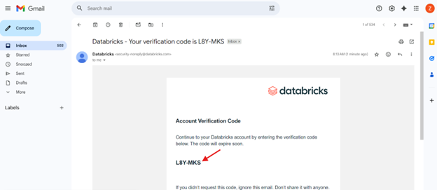

# Getting Started with Databricks

## Databricks Free Edition Account Sign-up

### Step 1: Navigate to the Databricks Free Edition Page
Go to the [Databricks Free Edition page](https://login.databricks.com/?dbx_source=docs&intent=CE_SIGN_UP) or type https://login.databricks.com/?dbx_source=docs&intent=CE_SIGN_UP

### Step 2: Choose a Sign-up Option and Enter Details
1. Choose one of the available sign-up options:
   - Email
   - Google
   - Microsoft
2. For this guide, we'll use the email option
3. Fill in your email address
4. Click "Continue"

### Step 3: Verify Your Email Address
1. Check your inbox for an email from Databricks
2. Locate the verification code
3. Copy the code

### Step 4: Set Up Your Account
1. Paste the verification code into the provided field
2. On the "Set up your account" page:
   - Option to rename your account
   - Option to change your location

### Step 5: Account Provisioning and Workspace Access
Wait a few seconds while Databricks provisions your workspace. Once complete, you'll have access to your new Databricks environment.

## Cloning the GitHub Repository

### Step 1: Initiate Git Folder Creation
1. Click the "+ New" button in the top right corner
2. Scroll down to "More"
3. Select "Git Folder"

### Step 2: Provide Git Repository URL
1. In the "Create Git folder" pop-up window:
   - Paste this URL: `https://github.com/DiloromA/databricks-agentbricks-wwc2025`
   - The Git provider and folder name will auto-populate

### Step 3: Create Git Folder
Click the blue "Create Git folder" button in the bottom right

### Step 4: Access the Cloned Repository
1. Navigate to the newly created Git folder
2. Find the cloned repository content
3. Open the workshop notebook to begin

